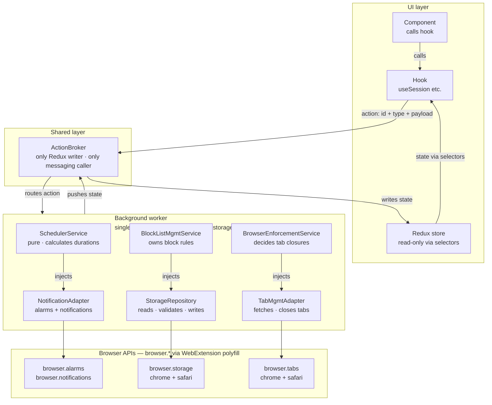
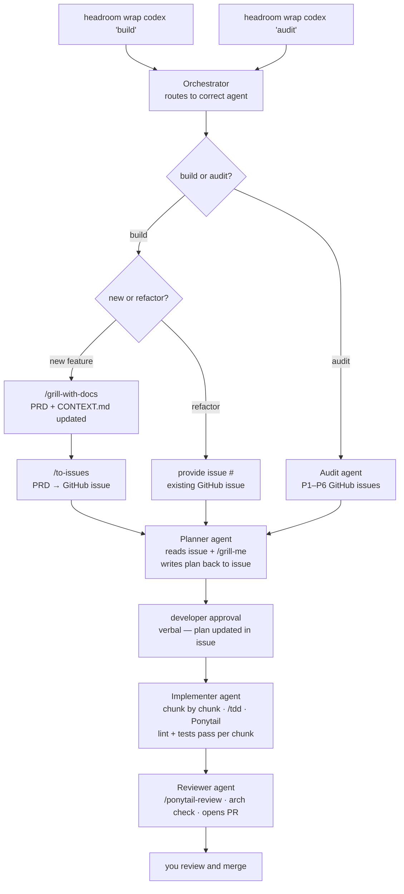

# Recess Architecture Blueprint v2

- **Status:** In progress
- **Created:** 2026-06-27
- **Scope:** Architecture, vocabulary, engineering standards, AI-assisted delivery, GitHub workflow, and future design-system work

This document is the authoritative reference for improving Recess. It defines the vocabulary, principles, and architecture decisions that govern how the codebase is structured and how work is delivered.

It does not claim that the target architecture is fully implemented. Every implementation phase still requires an approved issue, current code exploration, a decision-complete plan, tests, independent review, and human merge approval.

---

## 1. Source priority

When sources disagree, use this order:

1. This blueprint and any decisions explicitly derived from it
2. `CONTEXT.md` and `docs/domain/rules.md`
3. `docs/domain/glossary.md`
4. Current code and tests as evidence of implemented behavior
5. Existing GitHub and design system files as legacy to audit, not preserve

New decisions made in this blueprint supersede older guidance, including `glossary.md`. Do not keep a rule merely because it appears in an instruction file.

---

## 2. Mission & Principles

Recess is a browser extension (Chrome + Safari, Manifest V3) that manages Work Sessions, Focus Blocks, Recesses, and Time Outs through a dynamic Scheduler. The codebase is designed to be safe to change, easy to test, and consistent across browsers. Every architectural decision serves those three goals.

### Session vocabulary

> Canonical definitions live in `docs/domain/glossary.md`. Product rules live in `docs/domain/rules.md`. The terms below are summaries only — the glossary is authoritative.

- **Work Session** — the top-level container for all activity. Its clock runs during Focus Blocks, Reward Games, Recesses, and Back to Work Countdowns. It pauses only during a Time Out.
- **Focus Block** — a Scheduler-defined interval of focused effort within a Work Session. The user cannot directly end a Focus Block.
- **Recess** — an earned recovery interval after a completed non-final Focus Block. Its duration is determined by the outcome selected during the Reward Game — one of three Scheduler-derived variants clamped to five through twenty minutes.
- **Time Out** — a user-initiated suspension during a Focus Block. Pauses both the Focus Block and Work Session clocks. Does not count toward Work Session time.
- **Reward Game** — a chance-based interaction before each Recess that selects one Block List entry and one duration variant. The Scheduler provides a base Recess duration. The game presents three possible duration variants — base minus five, base, and base plus five minutes — each clamped to five through twenty minutes. The selected outcome's Block List entry and duration variant become the Recess configuration. Three mechanics cycle in sequence across Work Sessions: Cards, then Wheel, then Slots.

### Browser extension vocabulary

- **Popup** — the short lived UI rendered when the user clicks the extension icon in the toolbar. Closes when the user clicks away. React runs here.
- **Extension page** — a full browser tab controlled by the extension, e.g. the settings page. Lives at a URL like `chrome-extension://[id]/settings.html`. Not an external website.
- **Background worker** — runs persistently behind the scenes with no UI. Owns all state, enforces blocking, handles alarms, and is the only writer to storage. Implemented as a Manifest V3 service worker.
- **Content script** — JavaScript injected by the extension into regular web pages. Not required for Recess blocking — the background worker handles tab URL detection and enforcement directly via `browser.tabs` with the `tabs` permission declared in the manifest.

### Communication vocabulary

- **Action** — a request sent from React to the background worker. Carries a unique ID, a type, and an optional payload. Can be rejected. Never a Redux dispatch.
- **State** — the current reality of the application, pushed from the background worker to React via ActionBroker, which writes it into the Redux store. Components never write to Redux directly.
- **Error** — sent from the background worker to React when an action is rejected. References the action ID. Handled by the component that sent the action.
- **ActionBroker** — the browser adapter responsible for routing actions from React to the background worker, and writing state and errors into the Redux store when the background worker responds. Wraps `browser.runtime` via the WebExtension polyfill. Lives under `/Shared/Adapters`. Neither services nor components interact with browser messaging APIs or dispatch to Redux directly.
- **Redux store** — a read-only mirror of background worker state in the UI. The only writer is ActionBroker. Components read from it via hooks and selectors. Redux is a UI state distribution mechanism, not a source of truth.

### Data flow

```
User interaction
→ Component calls a hook (e.g. useSession)
→ Hook sends action via ActionBroker to background worker
→ Background worker validates and processes the action
→ Background worker updates storage
→ Background worker pushes new state via ActionBroker
→ ActionBroker dispatches to Redux store
→ Components re-render via selectors
```

If the action is rejected:

```
Background worker sends error referencing the action ID
→ ActionBroker routes error to the originating component
→ Component displays error to the user
```

---

### Principles

**SOLID**

- **Single Responsibility** — every service, adapter, and component has one reason to change. If describing what something does requires the word "and", it should be two things. Pattern: _Separation of Concerns_ — business logic, browser operations, and UI rendering live in separate layers and never bleed into each other.

- **Open/Closed** — behaviour is extended by adding new pieces, not by modifying existing ones. Pattern: _Composition over inheritance_ — complex behaviour is built by combining simple services and adapters rather than through class hierarchies.

- **Liskov Substitution** — swapping one implementation for another leaves the rest of the system unchanged. Pattern: _Cross-browser adapters_ — Chrome and Safari adapters behave identically from the perspective of the services that depend on them. A `SafariTabAdapter` is a drop-in replacement for a `ChromeTabAdapter`.

- **Interface Segregation** — callers depend only on what they use. Every service defines its own TypeScript interface describing only what it needs from each dependency. If `SchedulerService` only needs `read` and `write` from storage, it receives an interface with only those two methods. Changes to the rest of `StorageRepository` cannot affect it.

- **Dependency Inversion** — high level services depend on abstractions, not concrete implementations. Pattern: _Dependency Injection_ — services receive their dependencies through focused interfaces rather than importing browser APIs or concrete classes directly. This makes testing and cross-browser support possible.

---

**Pure functions for business logic**
Functions that calculate things — durations, phase transitions, block list decisions — take inputs and return outputs with no side effects. They are testable without a browser and without mocking.

**Single source of truth**
Every piece of data has exactly one owner. The background worker owns state. Storage owns persistence. No two parts of the system maintain separate representations of the same fact.

**Immutability**
State is never mutated directly. The background worker always produces a new version of state when something changes. This prevents bugs where two parts of the code hold a reference to the same object and one silently changes it.

**Idempotency**
Performing the same operation twice produces the same result as performing it once. If the browser fires an alarm twice due to a race condition, closing the same tab twice must be safe.

**Fail fast**
When something is wrong, surface the error immediately rather than letting bad data propagate silently. Validate data at boundaries — especially on reads from storage and on incoming actions.

**Defence in depth**
Do not trust data coming in from outside your layer. Each layer validates what it receives. A service does not assume the data passed to it from an adapter is clean.

**DRY**
Every piece of knowledge has a single representation in the codebase. If block list matching logic exists in two places, they will eventually diverge.

---

### Communication model

The background worker and React UI communicate through three message types:

**Actions** — sent from React to the background worker. An action is a request, not a guarantee. The background worker may reject it. Every action is a discriminated union typed in `/Shared/Types/actions.ts`. At minimum every action carries a unique ID, a type, and an optional payload typed to that specific action.

```ts
// Example — see /Shared/Types/actions.ts for full union
interface StartFocusBlockAction {
  id: string;
  type: 'START_FOCUS_BLOCK';
  payload: { duration: number };
}

type RecessAction = StartFocusBlockAction | EndFocusBlockAction | TakeTimeoutAction;
```

**State** — pushed from the background worker to React after any change. ActionBroker writes it into the Redux store. Components read via hooks and selectors. React never pulls state directly from storage.

**Errors** — sent from the background worker to React when an action is rejected. Transient and separate from state. Each error references the ID of the action that caused it. The component that sent the action is responsible for displaying and dismissing the error.

```ts
{
  actionId: string
  message: string
  code?: string
}
```

---

### Success criteria

**Testing**

- Every service has a corresponding unit test file
- Every pure function has unit tests with no browser dependencies
- Adapters can be swapped for in-memory fakes in tests
- No unit test requires a real browser to run
- Key service combinations that are high risk have integration tests
- Critical user flows are covered by end to end tests using a real browser environment

**Architecture boundaries**

- No service imports a browser API directly
- No adapter contains business logic
- No React component reads from storage directly
- No React component dispatches to Redux directly — only ActionBroker writes to the Redux store
- State flows in one direction only — background worker → ActionBroker → Redux store → components
- No two services write to the same storage key
- Every action from React can be rejected by the background worker
- Components that send actions are responsible for handling their own errors
- Every service defines a focused interface per dependency — no service depends on methods it does not use

**Cross-browser**

- Every browser API is wrapped in an adapter under `/Background/Adapters` or `/Shared/Adapters`
- Swapping a Chrome adapter for a Safari one requires no changes to services
- Chrome and Safari adapter implementations are interchangeable from the perspective of any service

**Code health**

- No file has more than one reason to change
- No business logic is duplicated across services
- Every action carries a unique ID and every error references that ID
- Arrow functions only — no function declarations or function expressions anywhere in the codebase

---

## 3. Layers, dependencies, and folder structure

### Dependency chain

```
/UI
  Pages
  └── Views
      └── Components
          └── Hooks (useSession, useBlockList, useScheduler)
              └── Redux store (read via selectors)
              └── ActionBroker (send actions only)

/Shared
  └── ActionBroker
      └── Background worker (via browser.runtime — WebExtension polyfill)

/Background
  └── Services
      SchedulerService
      BlockListManagementService
      BrowserEnforcementService
  └── Adapters
      TabManagementAdapter
      NotificationAdapter
  └── Repositories
      StorageRepository
      └── Browser storage API (browser.storage — WebExtension polyfill)
```

### Data flow diagram



**UI layer** (`/UI`)

- Components never read from storage directly
- Components never dispatch to Redux directly
- Components never import from `/Background`
- Components send actions via hooks only
- Hooks read state from Redux via selectors
- Hooks send actions via ActionBroker
- Redux store is read-only from the UI's perspective

**Shared layer** (`/Shared`)

- ActionBroker is the only piece allowed to write to the Redux store
- ActionBroker is the only piece allowed to call browser messaging APIs
- Types and constants have no dependencies on `/UI` or `/Background`

**Background layer** (`/Background`)

- Services never import browser APIs directly
- Services receive all dependencies via dependency injection through focused interfaces
- Adapters and repositories are the only files that import browser APIs
- StorageRepository is the only writer to browser storage
- Background worker is the only writer to application state

### Folder structure

```
/Background
  /Services
    SchedulerService.ts
    BlockListManagementService.ts
    BrowserEnforcementService.ts
  /Adapters
    TabManagementAdapter.ts
    NotificationAdapter.ts
  /Repositories
    StorageRepository.ts

/UI
  /Pages
    /Popup          — main extension popup
    /Home           — dashboard extension page
    /Settings       — settings extension page
    /RewardGame     — extension page, opens as a tab when Recess is earned
  /Views
  /Components
  /Hooks
    useSession.ts             — Work Session state and actions (illustrative)
    useBlockList.ts           — Block List state and actions (illustrative)
    useScheduler.ts           — Focus Block duration and timing state (illustrative)
  /Redux
    store.ts
    /Slices
      sessionSlice.ts         — (illustrative)
      blockListSlice.ts       — (illustrative)
      schedulerSlice.ts       — (illustrative)
    /Selectors
      sessionSelectors.ts     — (illustrative)
      blockListSelectors.ts   — (illustrative)
      schedulerSelectors.ts   — (illustrative)

/Shared
  /Adapters
    ActionBroker.ts
  /Interfaces
  /Types
  /Constants
```

---

## 4. AI-assisted development workflow

Every feature or change follows this workflow in order. No step may be skipped.

### Step 1 — Groom

The AI runs `/grill-with-docs` to interview the developer and capture the full details of the requested feature. The output is a **Product Requirements Document (PRD)** describing what the feature does, who it serves, and what success looks like. `CONTEXT.md` is updated inline. No implementation details at this stage.

### Step 2 — GitHub issue (PRD only)

The AI runs `/to-issues` to create a GitHub issue containing only the PRD. The implementation plan is not included yet.

### Step 3 — Implementation plan

The AI scans the codebase and produces a detailed implementation plan that:

- Follows all architecture principles and folder structure defined in this blueprint
- Maps every change to a specific file
- Divides the work into logical chunks, each with its own verification step
- Includes a testing strategy for each chunk

Every proposed change must pass this checklist before it appears in the plan:

1. **Does this need to exist?** — if no, skip it
2. **Already in this codebase?** — if yes, reuse it, don't rewrite it
3. **Does the standard library do it?** — if yes, use it
4. **Is it a native platform feature?** — if yes, use it
5. **Is there an installed dependency that does it?** — if yes, use it
6. **Can it be done in one line?** — if yes, one line
7. **Only then** — write the minimum that works

If a proposed change cannot pass this checklist, it is removed from the plan.

### Step 3b — ADR (if applicable)

If the implementation plan involves a significant architectural decision, the AI drafts an ADR and includes it alongside the plan for review. See Section 6 for ADR criteria and format. The ADR is approved together with the plan before implementation begins.

### Step 4 — Developer approval

The developer reviews the implementation plan verbally. Once approved, the AI updates the GitHub issue with the full implementation plan. The updated issue is the signal that implementation is cleared to begin.

### Step 5 — Branch

The AI creates a branch using the convention:

```
issue-{number}/{short-description}
e.g. issue-42/scheduler-service
```

### Step 6 — Implement

The AI implements one chunk at a time following the approved plan. After each chunk:

- Linting must pass
- All relevant tests must pass
- Ponytail reviews the changes for minimal footprint

If verification fails, the AI stops and flags the developer before continuing. The next chunk does not begin until the current chunk is verified.

### Step 7 — Final verification

Once all chunks are complete, the full test suite runs including unit, integration, and any relevant end to end tests.

### Step 8 — Pull request

The AI opens a PR containing:

- A summary of what changed and why
- A link to the GitHub issue
- A checklist confirming linting passed, all tests passed, and Ponytail review completed
- Screenshots or notes for any UI changes

The developer reviews and merges. The AI never merges a PR.

### Workflow diagram



---

## 5. Testing strategy

### Frameworks

- **Vitest** — unit and integration tests
- **Playwright** — end to end tests with native browser extension support

### Coverage threshold

Vitest is configured to enforce a minimum of **80% coverage**. A build fails if coverage drops below this threshold.

### Test file locations

**Unit tests** — colocated next to the file they test:

```
/Background/Services/SchedulerService.ts
/Background/Services/SchedulerService.test.ts
```

**Integration and E2E tests** — top level `/Tests` folder:

```
/Tests
  /Integration
    block-list-enforcement.test.ts
    scheduler-notification.test.ts
    action-broker-redux.test.ts
    storage-block-list.test.ts
  /E2E
    focus-block.test.ts
    recess.test.ts
    block-enforcement.test.ts
```

### Unit tests

Every service, adapter, repository, hook, selector, and pure function has a colocated unit test file. Unit tests have no browser dependencies and run without a real browser environment. Adapters and repositories are replaced with in-memory fakes in unit tests.

### Integration tests

Write an integration test wherever two pieces pass data to each other and a bug in the handoff would not be caught by either unit test in isolation.

Reference examples:

- `BlockListManagementService` + `BrowserEnforcementService` — does enforcement correctly close tabs given a block list from the management service?
- `SchedulerService` + `NotificationAdapter` — does the right notification get scheduled for the duration the scheduler calculates?
- `ActionBroker` + Redux store — when the background worker pushes state, does it land correctly in the right slices?
- `StorageRepository` + `BlockListManagementService` — when the block list is read from storage, does the management service correctly reconstruct its rules?

These are reference examples, not an exhaustive list. Apply the principle as the codebase grows.

### End to end tests

E2E tests cover critical user flows using a real browser environment via Playwright. They are the only tests that prove the full system works together across both environments.

Reference flows:

- User starts a focus block — blocked sites are closed
- User completes a focus block — recess notification fires at the correct time
- User takes a Time Out — timer pauses and Work Session time does not advance
- Recess ends — user is returned to focus block, reward site closes

### Test rules

- No unit test requires a real browser to run
- No business logic is tested only at the integration or E2E level — it must have unit tests first
- A chunk is not complete until its tests pass — no exceptions

---

## 6. Architectural Decision Records (ADRs)

ADRs capture significant architectural decisions, why they were made, and what alternatives were considered. They are not required for every decision — only those where future context would be lost without a record.

All existing ADRs are superseded by this blueprint. The ADR log starts fresh from the decisions made here.

### When to write an ADR

**Write an ADR when:**

- You chose between two or more reasonable alternatives
- The decision has broad impact across the codebase
- Reversing the decision later would be expensive or painful
- The reasoning is not already captured in the blueprint

**Do not write an ADR when:**

- The decision is obvious given the principles
- The blueprint already explains the why
- It is an implementation detail that could change without architectural impact

### ADR location and naming

ADRs live under `/Docs/ADR` and are named sequentially with the topic:

```
/Docs/ADR
  ADR-001-redux-over-context.md
  ADR-002-background-worker-single-writer.md
  ADR-003-action-broker-only-redux-dispatcher.md
  ADR-004-vitest-playwright-testing-stack.md
  ADR-005-background-ui-shared-folder-structure.md
```

### ADR template

```md
# ADR-{number}: {topic}

## Date

YYYY-MM-DD

## Decision

One or two sentences describing what was decided.

## Alternatives considered

- Alternative A
- Alternative B

## Reasoning

Why this decision was made over the alternatives.

## Consequences

What this decision means for the codebase going forward.
```

### ADRs in the AI workflow

If an implementation plan involves a significant architectural decision, the AI drafts an ADR and includes it alongside the plan for developer review. The ADR is approved together with the plan before implementation begins. Approved ADRs are committed on the same branch as the implementation.

---

## 7. Type safety

### TypeScript configuration

`"strict": true` is enabled in `tsconfig.json`. This enables:

- `noImplicitAny` — no accidental `any` from untyped parameters
- `strictNullChecks` — `null` and `undefined` are not assignable unless explicitly allowed
- `strictFunctionTypes` — function parameter types are checked correctly
- `strictPropertyInitialization` — class properties must be initialized

### No `any` or `unknown` in interfaces or types

`any` and `unknown` are never used in interfaces or types. All untyped data entering from browser APIs must pass through a type guard before use.

ESLint enforces this via `@typescript-eslint/consistent-type-assertions` — unsafe `as` casts are a build error. Type guards are used instead.

### Type guards at boundaries

Every place where untrusted data enters the system uses a type guard to validate the shape before use:

**Storage reads** — `StorageRepository` validates every value read from storage before returning it:

```ts
async getBlockList(): Promise<BlockList> {
  const result = await browser.storage.local.get(StorageKeys.BLOCK_LIST)
  const data = result[StorageKeys.BLOCK_LIST]

  if (!isBlockList(data)) {
    throw new Error('Invalid block list in storage')
  }

  return data
}
```

**Message passing** — `ActionBroker` validates every incoming message before handling it:

```ts
browser.runtime.onMessage.addListener((message) => {
  if (!isRecessAction(message)) {
    return;
  }
  handleAction(message);
});
```

### Interface vs type

**Use an interface for:**

- Object shapes — data structures, state shapes, error shapes
- Dependency interfaces colocated with the function that uses them

**Use a type for:**

- Discriminated unions — `RecessAction`
- Unions of primitives — `Phase`

Individual action shapes are interfaces. The `RecessAction` union that combines them is a type:

```ts
interface StartFocusBlockAction {
  id: string;
  type: 'START_FOCUS_BLOCK';
  payload: { duration: number };
}

interface EndFocusBlockAction {
  id: string;
  type: 'END_FOCUS_BLOCK';
  payload?: never;
}

type RecessAction = StartFocusBlockAction | EndFocusBlockAction;
```

### Naming convention

No `I` prefix. No `Contract` or `Port` suffix. Names describe what they represent:

```ts
interface BlockList { ... }       // not IBlockList
interface RecessState { ... }     // not RecessStateInterface
type Phase = 'focus' | 'recess'  // not PhaseType
```

### Dependency interfaces

Background services are plain functions. Each function declares exactly what it needs from its dependencies as a colocated interface — never exported, never shared:

```ts
// /Background/Services/SchedulerService.ts

interface SchedulerStorage {
  read: (key: string) => Promise<unknown>;
  write: (key: string, value: unknown) => Promise<void>;
}

function calculateDuration(variables: WeightedVariables, storage: SchedulerStorage): number {
  // pure logic, no browser APIs
}
```

This implements Interface Segregation and Dependency Inversion from SOLID. The function depends on an abstraction with only what it needs — not on a concrete implementation.

### Where types and interfaces live

```
/Shared
  /Interfaces           — object shapes used by more than one layer
    blockList.ts
    recessState.ts
    recessError.ts
  /Types                — unions and discriminated unions used by more than one layer
    actions.ts
    domain.ts
  /Constants
    /ActionTypes
      sessionActionTypes.ts
      blockListActionTypes.ts
      schedulerActionTypes.ts
    /StorageKeys
      sessionStorageKeys.ts
      blockListStorageKeys.ts
    /AlarmNames
    /NotificationTypes
    /PhaseNames
```

Colocated dependency interfaces — defined next to the function that uses them, never exported.

Component prop types — colocated with the component they describe, never exported.

---

## 8. Cross-browser strategy

Recess targets Chrome and Safari from day one. All browser API access is abstracted behind adapters so services are never aware of which browser they are running on.

### WebExtension polyfill

Recess uses Mozilla's WebExtension browser API Polyfill as the foundation for all browser API access. The polyfill provides a consistent `browser.*` namespace across Chrome and Safari, handling namespace and async differences automatically.

All adapters use `browser.*` syntax. Never use `chrome.*` directly anywhere in the codebase.

Install via npm:

```
npm install webextension-polyfill
```

### API compatibility for Recess

The APIs Recess depends on are well supported on both Chrome and Safari under Manifest V3:

| API                     | Chrome | Safari | Notes                                                        |
| ----------------------- | ------ | ------ | ------------------------------------------------------------ |
| `browser.tabs`          | ✅     | ✅     | Requires `tabs` permission in manifest                       |
| `browser.storage.local` | ✅     | ✅     | Session storage not supported in Safari — not used by Recess |
| `browser.runtime`       | ✅     | ✅     | ActionBroker uses this for message passing                   |
| `browser.alarms`        | ✅     | ✅     | NotificationAdapter uses this for scheduling                 |
| `browser.notifications` | ✅     | ✅     | NotificationAdapter uses this for firing alerts              |

### Adapter rules

- Every browser API is wrapped in an adapter under `/Background/Adapters` or `/Shared/Adapters`
- Adapters use `browser.*` via the polyfill — never `chrome.*` directly
- Services never import from adapters directly — they receive them as injected dependencies
- Swapping a Chrome behaviour for a Safari one requires no changes to services
- Where a genuine API gap exists between browsers, the adapter handles it internally — services never see the difference

### Manifest

Two separate `manifest.json` files are maintained — one for Chrome, one for Safari. They share the same permissions and structure but account for browser-specific manifest key differences. Both target Manifest V3.

```
/manifest.chrome.json
/manifest.safari.json
```

### Safari development requirement

Safari extension development requires a Mac with Xcode. Safari extensions must be wrapped in a native app container and submitted through the Mac App Store or iOS App Store separately from the Chrome Web Store.

### Testing cross-browser

- Unit and integration tests run against the polyfill — no browser-specific test setup needed
- E2E tests run against both Chrome and Safari using Playwright's browser extension support
- A build is not considered complete until E2E tests pass on both browsers
