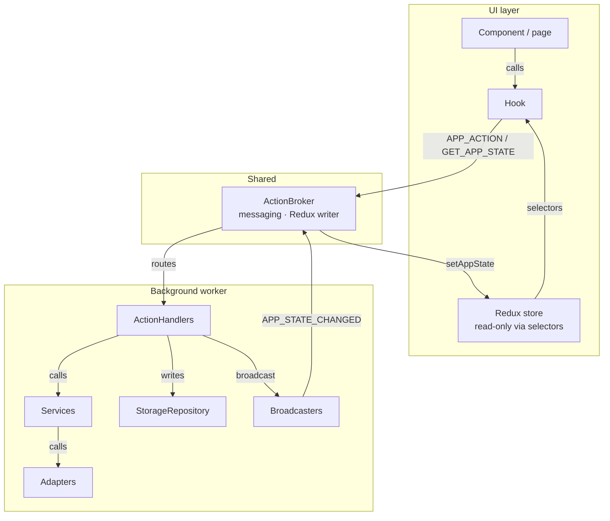

# Recess Architecture Blueprint v2

- **Status:** As-built with labeled follow-ups
- **Updated:** 2026-08-16
- **Scope:** Architecture, engineering standards, type safety, cross-browser packaging

This document is the authoritative architecture reference for Recess. Structure, messaging, and layer rules describe the **current codebase** unless marked **Follow-up**.

Product language lives in `docs/domain/glossary.md` and `docs/domain/rules.md`. Agent delivery workflow lives in `AGENTS.md` and `.github/agents/`.

Every implementation change still requires an approved issue, current code exploration, a decision-complete plan, tests, independent review, and human merge approval.

---

## 1. Source priority

When sources disagree, use this order:

1. This blueprint and decisions explicitly derived from it
2. `CONTEXT.md` and `docs/domain/rules.md`
3. `docs/domain/glossary.md`
4. Current code and tests as evidence of implemented behavior
5. Older design-system or legacy docs as historical only

New decisions in this blueprint supersede older architecture guidance.

---

## 2. Mission & principles

Recess is a browser extension (Chrome + Safari, Manifest V3) that manages Work Sessions, Focus Blocks, Recesses, and Time Outs through a dynamic Scheduler. The codebase is designed to be safe to change, easy to test, and consistent across browsers.

### Vocabulary

- **Domain terms** (Work Session, Focus Block, Recess, Time Out, Reward Game, Block List, etc.) — `docs/domain/glossary.md`
- **Product rules** — `docs/domain/rules.md`

**Browser / communication terms used in this doc:**

- **Popup** — short-lived toolbar UI; React runs here
- **Extension page** — full tab owned by the extension (e.g. Home)
- **Background worker** — Manifest V3 service worker; owns application state; only writer to storage
- **App action** — typed command from UI → background (`AppAction`); never a Redux dispatch
- **ActionBroker** — Shared messaging adapter (`/Shared/ActionBrokers`); sole caller of browser messaging APIs; sole writer to Redux (**Follow-up:** hydrate/subscribe still dispatch from `main.tsx` today)
- **Redux store** — read-only mirror of background state for the UI

### Data flow

```
User interaction
  → Hook or page calls sendAppAction(action)
  → ActionBroker sends { type: 'APP_ACTION', action } via browser.runtime
  → background.ts routes to ActionHandlers
  → applyAppAction / services produce next PersistedAppState
  → StorageRepository writes state
  → Broadcasters push { type: 'APP_STATE_CHANGED', state }
  → UI subscription dispatches setAppState to Redux
  → Components re-render via selectors
```

Action responses are synchronous reply shapes: `{ ok: true } | { ok: false; error: 'invalid-action' }`. There is no separate pushed error event type.

### Principles

**SOLID (applied)**

- **Single Responsibility** — business logic, browser I/O, and UI rendering stay in separate layers
- **Open/Closed** — extend by adding pieces; prefer composition over inheritance
- **Liskov Substitution** — adapters for Chrome/Safari present the same surface to services
- **Interface Segregation** — prefer narrow adapter/repository APIs
- **Dependency Inversion** — domain rules live in services; adapters/repositories are details services call. Services must not call `browser.*` / `chrome.*` directly. Injecting deps as function parameters is optional (use when it helps tests)

**Services own business logic**

All domain behavior lives in `/Background/Services`. ActionHandlers, ActionBroker, adapters, repositories, utils, and Redux do not invent domain rules. Other parts of the app call services; services call adapters, repositories, and utils.

**Pure functions where they help**

Isolated calculations should prefer pure inputs/outputs. Service functions that orchestrate domain work may call adapters/repositories (side effects allowed).

**Single source of truth** — background owns state; storage owns persistence  
**Immutability** — updates produce new state objects  
**Idempotency** — repeated ops (e.g. close same tab) must be safe  
**Fail fast** — validate at storage and messaging boundaries; invalid storage shapes throw  
**Defence in depth** — each layer validates what it receives  
**DRY** — one representation per piece of knowledge

### Success criteria

**Testing**

- Colocated Vitest unit tests where risk warrants them
- Domain logic unit tests do not require a real browser
- Manual smoke checks in `README.md`

**Architecture boundaries**

- No service imports a browser API directly
- Business logic lives only in services
- No adapter, repository, or util contains domain rules
- UI does not import `/Background`
- Components do not read storage or dispatch Redux for domain changes
- State flows: background → ActionBroker → Redux → components
- Actions flow: UI → ActionBroker → background
- `StorageRepository` is the only storage writer
- All browser APIs use `browser.*` via the WebExtension polyfill — never `chrome.*`

**Code health**

- Arrow functions only — no classes, no function declarations
- No `any`, `unknown`, or unsafe `as` casts — type guards / Zod at boundaries

---

## 3. Layers and folder structure

### Dependency chain

```
/UI
  Pages → Views → Components → Hooks
    → Redux (read via selectors)
    → ActionBroker (sendAppAction / getAppState / subscribe)

/Shared
  ActionBrokers → background (browser.runtime)
  Types, Constants, Schema, State, Utils

/Background
  background.ts (message router)
  ActionHandlers (wire requests → services / storage / broadcast)
  Broadcasters (push APP_STATE_CHANGED)
  Services (domain logic; nested folders; no fixed inventory)
  Adapters (TabAdapter, AlarmAdapter, ActionAdapter, Notification/…)
  Repositories (StorageRepository → browser.storage)
```

### Data flow diagram


```mermaid
flowchart TD
    subgraph UI["UI layer"]
        C["Component / page"]
        H["Hook"]
        R["Redux store\nread-only via selectors"]
        C -->|calls| H
        R -->|selectors| H
    end

    subgraph SH["Shared"]
        AB["ActionBroker\nmessaging · Redux writer"]
    end

    subgraph BG["Background worker"]
        AH["ActionHandlers"]
        SV["Services"]
        AD["Adapters"]
        SR["StorageRepository"]
        BRD["Broadcasters"]
        AH -->|calls| SV
        SV -->|calls| AD
        AH -->|writes| SR
        AH -->|broadcast| BRD
    end

    H -->|APP_ACTION / GET_APP_STATE| AB
    AB -->|routes| AH
    BRD -->|APP_STATE_CHANGED| AB
    AB -->|setAppState| R
```

**UI (`/UI`)**

- No storage reads; no domain Redux dispatches from components
- No imports from `/Background`
- Hooks and pages send app actions via ActionBroker
- Hooks read state from Redux selectors

**Shared (`/Shared`)**

- ActionBroker: only messaging caller; only Redux writer (target rule — see Follow-up)
- Types, constants, schema, defaults have no deps on `/UI` or `/Background`

**Background (`/Background`)**

- Services own domain logic; may import adapters/repositories/utils
- ActionHandlers and Broadcasters are plumbing only
- Adapters/repositories are the only browser API importers
- Adapters contain no domain rules (tab close *decisions* live in services)

### Folder structure (as-built)

```
/Background
  background.ts
  content.ts
  /ActionHandlers
  /Broadcasters
  /Services
    /Scheduler
    /BlockListManagement
    /Reward
    /Coin
    /WorkStartReminder
  /Adapters
    TabAdapter.ts
    AlarmAdapter.ts
    ActionAdapter.ts
    /Notification
  /Repositories
    StorageRepository.ts

/UI
  /Pages          — Home, Onboarding, Quiz, PersonalizationQuiz, …
  /Views
  /Components
  /Hooks          — useTimer, useRecessPicker, …
  /Redux
    store.ts
    /Slices/AppState     — single appState mirror today
    /Selectors           — Scheduler, RecessPicker, Quiz, …

/Shared
  /ActionBrokers/ActionBroker.ts
  /Types
  /Constants/Constants.ts
  /Schema/PersistedAppStateSchema.ts
  /State/defaults.ts
  /Utils
```

Do not maintain a fixed service inventory in this doc — services come and go; the layer rules matter.

### App actions flow

**Wire messages**

- `BackgroundRequest` — UI → background, expects a response: `GET_APP_STATE` | `APP_ACTION`
- `BackgroundEvent` — background → UI, no response: `APP_STATE_CHANGED`

**App actions**

- Defined in `APP_ACTION` (`/Shared/Constants/Constants.ts`)
- Discriminated union `AppAction` in `/Shared/Types/AppState.ts` — `type` + inline fields (no action `id`, no `payload` wrapper)
- Handled in `ActionHandlers/appStateActionHandler.ts` via `applyAppAction`

Adding an action: update `APP_ACTION`, `AppAction`, `applyAppAction`, and the UI call site.

**Key files**

| File | Role |
| ---- | ---- |
| `src/Shared/ActionBrokers/ActionBroker.ts` | UI ↔ background messaging |
| `src/Shared/Types/AppState.ts` | `AppAction`, `RuntimeMessage`, `PersistedAppState` |
| `src/Shared/Constants/Constants.ts` | `APP_ACTION` strings |
| `src/Background/background.ts` | Message router |
| `src/Background/ActionHandlers/appStateActionHandler.ts` | Action handling |
| `src/Background/Broadcasters/appStateBroadcaster.ts` | State broadcast |
| `src/Background/Repositories/StorageRepository.ts` | Persistence |
| `src/UI/main.tsx` | Bootstrap / hydrate (until ActionBroker owns Redux writes) |

---

## 4. AI-assisted development workflow

Delivery workflow, branch naming, PR checklist, and agent routing live in **`AGENTS.md`** and `.github/agents/`. Do not duplicate them here.

Planning still uses the minimalism ladder from `AGENTS.md`. Significant architectural decisions may use ADRs (Section 6).

---

## 5. Testing strategy

### Framework

- **Vitest** — `npm test` / `vitest run`

### Locations

Colocated next to source:

```
/Background/Services/Scheduler/SchedulerService.ts
/Background/Services/Scheduler/SchedulerService.test.ts
```

No top-level `/Tests` tree. No Playwright or other E2E harness.

### Rules

- Prefer unit tests without a real browser for domain logic
- Fake or lightly mock adapters/repositories at boundaries
- Chunk incomplete until relevant tests pass
- Manual browser smoke checks: `README.md`

---

## 6. Architectural Decision Records (ADRs)

ADRs capture significant decisions, alternatives, and consequences when future context would otherwise be lost.

**Write an ADR when:** multiple reasonable alternatives; broad impact; expensive to reverse; reasoning not already in this blueprint.

**Skip when:** obvious from principles; already explained here; reversible implementation detail.

**Location:** `/Docs/ADR` — `ADR-{number}-{topic}.md`

```md
# ADR-{number}: {topic}

## Date
YYYY-MM-DD

## Decision
…

## Alternatives considered
…

## Reasoning
…

## Consequences
…
```

Approved ADRs ship on the same branch as the related implementation.

---

## 7. Type safety

### TypeScript

`"strict": true` in `tsconfig.json` (includes `noImplicitAny`, `strictNullChecks`, etc.).

### No `any` / `unknown` / unsafe `as`

Do not use `any` or `unknown` in public interfaces/types. Untyped browser data must pass Zod or a type guard before use.

ESLint: `@typescript-eslint/consistent-type-assertions` — unsafe `as` casts are errors (**Follow-up:** enforce in `eslint.config.js` if not already).

### Boundaries

**Storage** — `StorageRepository` reads/writes `PersistedAppState` via Zod (`/Shared/Schema/PersistedAppStateSchema.ts`). Invalid shapes **throw** (fail fast). Use `browser.storage` — never `chrome.storage`.

```ts
const result = await browser.storage.local.get(APP_STATE_KEY);
return parsePersistedAppStateOrThrow(result[APP_STATE_KEY]);
```

**Messaging** — ActionBroker validates incoming runtime messages (e.g. `APP_STATE_CHANGED`) before updating Redux. Background request routing stays thin.

### Interface vs type

- **Interface** — object shapes (state, entries, optional narrow test deps)
- **Type** — unions / discriminated unions (`AppAction`, `SchedulerPhase`)

No `I` prefix. Names describe what they represent.

### Services and dependencies

Plain arrow functions. Own domain rules; may import adapters, repositories, shared utils. Never call `browser.*` / `chrome.*` directly.

### Where shared types live

```
/Shared
  /Types          — AppState, Quiz, …
  /Constants      — flat Constants.ts today; domain folders are Follow-up
  /Schema         — Zod for persisted state
  /State          — defaults
  /ActionBrokers
  /Utils
```

Component prop types stay colocated with components.

---

## 8. Cross-browser strategy

Chrome and Safari from day one. Browser APIs behind adapters so services stay browser-agnostic.

### WebExtension polyfill

Use `webextension-polyfill`. All adapters and ActionBroker use **`browser.*` only** — never `chrome.*`.

### API compatibility

| API | Chrome | Safari | Notes |
| --- | ------ | ------ | ----- |
| `browser.tabs` | ✅ | ✅ | `tabs` permission |
| `browser.storage.local` | ✅ | ✅ | No session storage |
| `browser.runtime` | ✅ | ✅ | ActionBroker messaging |
| `browser.alarms` | ✅ | ✅ | `AlarmAdapter` |
| `browser.notifications` | ✅ | ✅ | When used for OS notifications |

### Adapter rules

- Browser APIs only under `/Background/Adapters`, `/Background/Repositories`, `/Shared/ActionBrokers`
- Services call adapters/repositories; adapters have no domain rules
- Browser gaps stay inside adapters

### Manifest and packaging

Single module: `manifest.config.ts` (CRXJS / Vite). Chromium artifact: `dist/` via `npm run build` + `package:chromium`. Safari: `package:safari` generates Xcode project under `build/safari/` (macOS + Xcode).

### Safari

Requires Mac + Xcode; native app container for store distribution.

### Verification

- Unit tests without a real browser
- Manual smoke checks for Chromium and Safari (`README.md`)
- CI runs `verify` including package scripts

---

## 9. Follow-up (agreed alignment work)

Tracked separately from this as-built rewrite. Do not treat these as already implemented.

1. **ActionBroker owns Redux** — move hydrate/subscribe `setAppState` out of `main.tsx`; validate messages in ActionBroker; thin `background.ts`
2. **`browser.*` everywhere** — migrate remaining `chrome.*` call sites
3. **Storage fail-hard** — Zod throws on invalid persisted state; `browser.storage` only
4. **ESLint** — enforce `consistent-type-assertions`
5. **Thin TabAdapter** — enforcement *decisions* only in services
6. **UI ↛ Background** — resolve TODOs in `useTimer.ts` and `schedulerSelectors.ts` (move helpers to `/Shared` or background-only paths)
7. **Domain Redux slices** — replace single `appState` slice; one selector module per slice
8. **Constants folders** — split `Constants.ts` by domain under `/Shared/Constants/`
9. **Quiz / Coin / WorkStartReminder** — actions and persistence still incomplete; leave until dedicated issues

Phases 1–3 of the architecture cleanup map to items 1–8 above.
