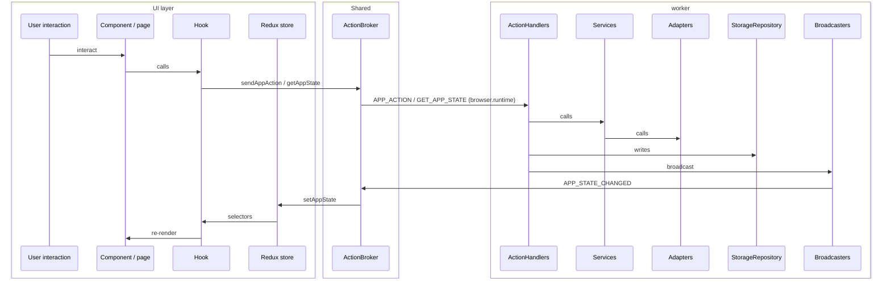

# Recess Architecture Blueprint

- **Status:** As-built with labeled follow-ups
- **Updated:** 2026-08-16
- **Scope:** Architecture, engineering standards, type safety, cross-browser packaging

This document is the authoritative architecture reference for Recess. Structure, messaging, and layer rules describe the **current codebase** unless marked **Follow-up**.

Every implementation change still requires an approved issue, current code exploration, a decision-complete plan, tests, independent review, and human merge approval.

---

## 1. Mission & principles

Recess is a browser extension that manages Work Sessions, Focus Blocks, Recesses, and Pauses through a dynamic Scheduler.

### Vocabulary

- **Domain terms** — `docs/domain/glossary.md`
- **Product rules** — `docs/domain/rules.md`

**Browser / communication terms used in this doc:**

- **Popup** — short-lived toolbar UI; React runs here
- **Extension page** — full tab owned by the extension
- **Background worker** — Manifest V3 service worker; owns application state; only writer to storage
- **App action** — command from UI to background (`AppAction`)
- **ActionBroker** — Shared messaging adapter (`/Shared/ActionBrokers`); sole caller of browser messaging APIs; sole writer to Redux (**Follow-up:** hydrate/subscribe still dispatch from `main.tsx` today)
- **Redux store** — read-only mirror of background state for the UI


### Principles

**SOLID** 

- **Single Responsibility** — business logic, browser I/O, and UI rendering stay in separate layers
- **Open/Closed** — extend by adding pieces; prefer composition over inheritance
- **Liskov Substitution** — adapters for Chrome/Safari present the same surface to services
- **Interface Segregation** — prefer narrow adapter/repository APIs
- **Dependency Inversion** — domain rules live in services; adapters/repositories are details services call. Services must not call `browser.`*  directly. Injecting deps as function parameters is optional (use when it helps tests)

**Single source of truth** — background owns state; storage owns persistence  
**Immutability** — updates produce new state objects  
**Idempotency** — repeated ops (e.g. close same tab) must be safe  
**Fail fast** — validate at storage and messaging boundaries; invalid storage shapes throw  
**DRY** — one representation per piece of knowledge

### Success criteria

**Testing**

- **Vitest** — `npm test`
- Colocated next to source (e.g. `SchedulerService.ts` + `SchedulerService.test.ts`); no top-level `/Tests` tree
- Prefer unit tests without a real browser for domain logic
- Fake or lightly mock adapters/repositories at boundaries
- Chunk incomplete until relevant tests pass
- Manual local run checks: `README.md`

**Architecture boundaries** — data flow in Section 2. Checklist:

- No service imports a browser API directly
- Business logic lives only in services
- No adapter, repository, or util contains domain rules
- UI does not import `/Background`
- Components do not read storage or dispatch Redux for domain changes
- `StorageRepository` is the only storage writer
- All browser APIs use `browser.*` via the WebExtension polyfill — never `chrome.*`

**Code health**

- Arrow functions only — no classes, no function declarations
- No `any`, `unknown`, or unsafe `as` casts — type guards / Zod at boundaries

---


## 2. Layers and folder structure


### Dependency chain

```
/UI
  Pages → Views → Components → Hooks
    → Redux (read via selectors)
    → ActionBroker (sendAppAction / getAppState / subscribe)

/Shared
  ActionBrokers → background (browser.runtime)
  Types, Constants, Schema, State, Utils (no deps on /UI or /Background)

/Background
  background.ts (message router)
  ActionHandlers (wire requests → services / storage / broadcast)
  Broadcasters (push APP_STATE_CHANGED)
  Services (domain logic; nested folders; no fixed inventory)
  Adapters (TabAdapter, AlarmAdapter, ActionAdapter, Notification/…)
  Repositories (StorageRepository → browser.storage)
```


### Data flow




## 3. Type safety


### TypeScript

`"strict": true` in `tsconfig.json` (includes `noImplicitAny`, `strictNullChecks`, etc.).

### No `any` / `unknown` / unsafe `as`

Do not use `any` or `unknown` in public interfaces/types. Untyped browser data must pass Zod or a type guard before use.

ESLint: `@typescript-eslint/consistent-type-assertions` — unsafe `as` casts are errors (**Follow-up:** enforce in `eslint.config.js` if not already).

### Boundaries

**Storage** — `StorageRepository` is the only reader/writer of `browser.storage.local` (`appState` key). Values pass Zod (`parsePersistedAppState`). As-built: invalid/missing → defaults. **Follow-up:** throw (fail fast). Never `chrome.storage` in new code — use `browser.storage` via the polyfill.

**Messaging** — ActionBroker validates incoming runtime messages (e.g. `APP_STATE_CHANGED`) before updating Redux. Background request routing stays thin.

### Interface vs type

- **Interface** — object shapes (state, entries, optional narrow test deps)
- **Type** — unions / discriminated unions (`AppAction`, `SchedulerPhase`)

No `I` prefix. Names describe what they represent. Component prop types stay colocated with components.

---


## 4. Cross-browser strategy

Chrome and Safari from day one. Browser APIs behind adapters so services stay browser-agnostic.

### WebExtension polyfill

Use `webextension-polyfill`. All adapters and ActionBroker use `browser.*` **only**.

### API compatibility


| API                     | Chrome | Safari | Notes                          |
| ----------------------- | ------ | ------ | ------------------------------ |
| `browser.tabs`          | ✅      | ✅      | `tabs` permission              |
| `browser.storage.local` | ✅      | ✅      | No session storage             |
| `browser.runtime`       | ✅      | ✅      | ActionBroker messaging         |
| `browser.alarms`        | ✅      | ✅      | `AlarmAdapter`                 |
| `browser.notifications` | ✅      | ✅      | When used for OS notifications |


### Manifest and packaging

Single module: `manifest.config.ts` (CRXJS / Vite). Chromium artifact: `dist/` via `npm run build` + `package:chromium`. Safari: `package:safari` generates Xcode project under `build/safari/` (macOS + Xcode).

---

## 5. App actions

UI sends typed commands; background is the only storage writer; UI refreshes from `APP_STATE_CHANGED` (Section 2 data flow). Sync ack from `sendAppAction` carries no state.

### Wire messages

- **Request** (`BackgroundRequest`) — UI → background: `GET_APP_STATE` | `{ type: 'APP_ACTION'; action: AppAction }`
- **Event** (`BackgroundEvent`) — background → UI: `{ type: 'APP_STATE_CHANGED'; state: PersistedAppState }`

### ActionBroker

| Function | Message | Purpose |
| --- | --- | --- |
| `sendAppAction(action)` | `APP_ACTION` | Request a state change |
| `getAppState()` | `GET_APP_STATE` | Initial hydrate |
| `subscribeToAppState(fn)` | `APP_STATE_CHANGED` | Keep Redux in sync |

Today `main.tsx` dispatches `setAppState` on hydrate/subscribe (**Follow-up:** ActionBroker owns Redux writes).

### Read path

UI never calls `browser.storage`. Only `StorageRepository.readAppState` reads the `appState` key from `browser.storage.local`, then Zod-parses via `parsePersistedAppState` (`/Shared/Schema/PersistedAppStateSchema.ts`). Missing or invalid shapes currently fall back to `createDefaultPersistedAppState()` (**Follow-up:** fail-hard / throw).

**UI hydrate (one-shot)**

1. `main.tsx` → `getAppState()` → `{ type: 'GET_APP_STATE' }`
2. `background.ts` → `handleGetAppState`
3. `storageRepository.readAppState()` → optional `syncBlockListEnforcementFlags` (may write back) → return `PersistedAppState`
4. `main.tsx` dispatches `setAppState`

After hydrate, the UI reads Redux selectors only. Later storage changes reach the UI via `APP_STATE_CHANGED`, not another storage read from the UI.

**Background-internal reads**

Handlers, adapters, and scheduler entrypoints that need current state call `storageRepository.readAppState()` directly (e.g. start of `handleAppAction`, `runScheduler`, tab enforcement). Same repository; no second storage API.

### Write path

`handleAppAction`: read storage → `applyAppAction` (reducer-style; calls services) → `StorageRepository` write → `broadcastAppState` → `{ ok: true }`.

Actions: `APP_ACTION` in `/Shared/Constants/Constants.ts`; `AppAction` union in `/Shared/Types/AppState.ts` (`type` + inline fields; no `id` / `payload` wrapper). Add one: update `APP_ACTION`, `AppAction`, `applyAppAction`, and the UI call site.

---

## 6. Follow-up (agreed alignment work)

Tracked separately from this as-built rewrite. Do not treat these as already implemented.

1. **ActionBroker owns Redux** — move hydrate/subscribe `setAppState` out of `main.tsx`; validate messages in ActionBroker; thin `background.ts`
2. `browser.*` **everywhere** — migrate remaining `chrome.`* call sites
3. **Storage fail-hard** — Zod throws on invalid persisted state; `browser.storage` only
4. **ESLint** — enforce `consistent-type-assertions`
5. **Thin TabAdapter** — enforcement *decisions* only in services
6. **UI ↛ Background** — resolve TODOs in `useTimer.ts` and `schedulerSelectors.ts` (move helpers to `/Shared` or background-only paths)
7. **Domain Redux slices** — replace single `appState` slice; one selector module per slice
8. **Constants folders** — split `Constants.ts` by domain under `/Shared/Constants/`
9. **Quiz / Coin / WorkStartReminder** — actions and persistence still incomplete; leave until dedicated issues

Phases 1–3 of the architecture cleanup map to items 1–8 above.