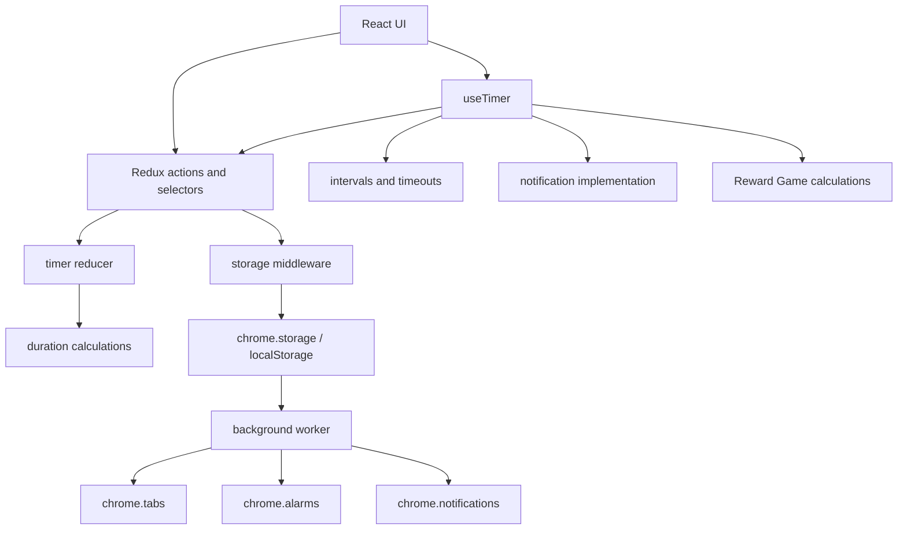
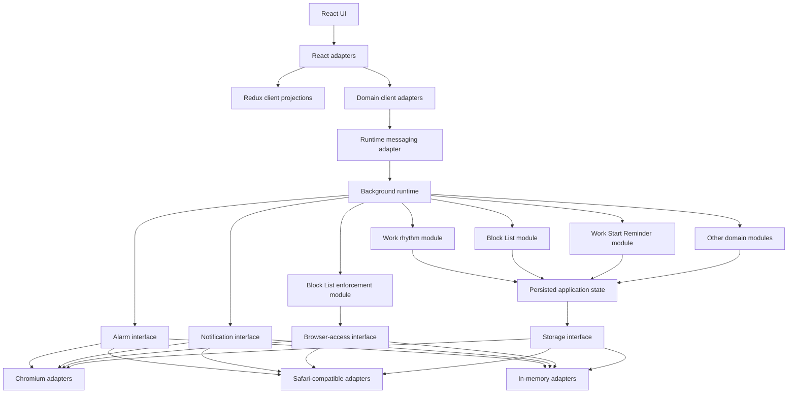

# Recess Architecture and AI Development Blueprint

- **Status:** Approved direction for teaching, planning, and rebuilding
- **Recreated:** 2026-06-21
- **Scope:** Architecture, domain alignment, engineering standards, AI-assisted delivery, GitHub workflow, and future design-system work

This document is the authoritative handoff for improving Recess. It explains the current codebase, the architecture it should grow toward, the order in which to change it safely, and how a human owner should direct AI agents through the complete development lifecycle.

It does not claim that the target architecture or full product model is implemented. Every implementation phase still requires an approved issue, current code exploration, a decision-complete plan, tests, independent review, and human merge approval.

## 1. Source priority

When sources disagree, use this order:

1. This blueprint and later accepted decisions derived from it.
2. [`CONTEXT.md`](../CONTEXT.md), [`docs/domain/glossary.md`](../docs/domain/glossary.md), and [`docs/domain/rules.md`](../docs/domain/rules.md).
3. Accepted decisions under `docs/adr/`.
4. Current code and tests as evidence of implemented behavior.
5. Existing `.github/*` and [`DESIGN_SYSTEM.md`](../DESIGN_SYSTEM.md) as legacy material to audit, not constraints to preserve.

New accepted decisions supersede old guidance. Do not keep a rule merely because it appears in an instruction file.

## 2. Mission

Recess should become easy to extend because important behavior is concentrated in deep modules with small interfaces. A developer or AI agent should be able to change one domain concept without reconstructing its rules from React, Redux actions, storage keys, timers, and browser callbacks scattered across the repository.

Success means:

- **Leverage:** a small interface enables many callers and tests to exercise substantial behavior.
- **Locality:** rules, bugs, knowledge, and verification for a domain concept live together.
- **Durability:** Work Sessions and browser enforcement continue correctly when the UI closes or an extension worker sleeps.
- **Testability:** callers and tests cross the same seam.
- **AI navigability:** source documents, module ownership, issue context, and checks are unambiguous.
- **Human control:** AI performs bounded work; a human owns intent, risk, architecture, merge, and release decisions.

## 3. Architecture vocabulary

| Term               | Meaning                                                                                                                     |
| ------------------ | --------------------------------------------------------------------------------------------------------------------------- |
| **Module**         | Anything with an interface and an implementation: a function, class, package, or tier-spanning slice.                       |
| **Interface**      | Everything a caller must know: operations, data, invariants, ordering, errors, configuration, and performance expectations. |
| **Implementation** | Behavior hidden inside a module.                                                                                            |
| **Depth**          | Leverage at the interface. A deep module hides substantial behavior behind a small interface.                               |
| **Seam**           | A place where behavior can vary without editing the caller. The interface lives at the seam.                                |
| **Adapter**        | A concrete implementation satisfying an interface at a seam.                                                                |
| **Leverage**       | Capability callers gain per unit of interface they learn.                                                                   |
| **Locality**       | How strongly change, knowledge, bugs, and tests concentrate in one place.                                                   |

Apply three tests:

1. **Deletion test:** if deleting the module spreads its complexity into callers, it was earning its place. If complexity disappears, it was probably shallow.
2. **Interface test surface:** tests should cross the same seam as callers. Tests reaching through the interface signal the wrong module shape.
3. **Adapter reality:** one adapter is a hypothetical seam; two adapters establish real variation.

## 4. Current-state diagnosis

### 4.1 Current execution shape



The problem is not the number of files. The problem is that understanding one concept requires learning too many interfaces and ordering rules.

### 4.2 Work rhythm has no single owner

Relevant implementation is split across `src/hooks/useTimer.ts`, timer Redux files, timer/duration calculations, `WorkPage`, state-specific views, notification delivery, and persistence.

Concrete friction:

- `useTimer` owns clock projection, intervals, completion delays, notifications, Reward Game generation, and Redux commands.
- The timer reducer owns transitions, duration calculations, pause/resume, Reward Game state, and direct `Date.now()` calls.
- `updateTimerState(Partial<TimerState>)` exposes implementation state instead of a domain command interface.
- `WorkPage` calls `useTimer`, while several child views call it again. Multiple mounted hooks can duplicate orchestration effects.
- Tests mirror the split: reducer transitions, hook effects, and calculations are checked independently while bugs can live in their ordering.
- Timer orchestration depends on the React UI being alive, which is inappropriate for extension behavior that should survive UI closure.

Deleting small calculation modules mostly moves formulas. Deleting a deep Work rhythm module would spread lifecycle, ordering, time, notifications, Reward Game behavior, and persistence across callers. The deep module is justified.

### 4.3 Work rhythm conflicts with the intended domain model

| Intended rule                                                                                                                 | Current mismatch                                                                                                                       |
| ----------------------------------------------------------------------------------------------------------------------------- | -------------------------------------------------------------------------------------------------------------------------------------- |
| A Work Session clock runs through Focus Blocks, Reward Games, Recesses, and Back to Work Countdowns; only Time Out pauses it. | `totalRemaining` is primarily reduced by Focus Block duration. Other active phases do not consistently consume the Work Session clock. |
| A user cannot directly end a Focus Block.                                                                                     | The UI and reducer expose ending a focus session early.                                                                                |
| Time Out is a distinct domain concept.                                                                                        | Pause/resume is mainly timer state without complete Time Out behavior.                                                                 |
| A completed non-final Focus Block can lead to a Reward Game, one Recess Pass, and Recess.                                     | Prompt, deferral, automatic decision, and pass lifecycle behavior is incomplete.                                                       |
| Focus Block Extension defers one earned Recess.                                                                               | No complete Focus Block Extension model exists.                                                                                        |
| Original completion survives Work Session Extension.                                                                          | No complete Work Session Extension model exists.                                                                                       |
| Wind-Down Signals and a ten-second Back to Work Countdown are domain behavior.                                                | Timing and notifications are partial and UI-owned.                                                                                     |

Cleanup is therefore not merely moving files. It must deliberately replace mismatched behavior with approved domain rules and tests.

### 4.4 Block List policy leaks across seams

Block List behavior is spread across `BlockedSites.tsx`, Redux, persistence normalization, `background.ts`, timer-state strings, selected Reward data, and browser operations.

- UI validation and background matching normalize differently.
- Redux stores unbranded strings, allowing invalid persisted shapes to reach enforcement.
- The background knows raw timer strings and `selectedReward.name` instead of domain access context.
- `FOCUS_BLOCKED_STATES` contains the literal `'FOCUS_BLOCKED_STATES'`, showing stringly leaked policy.
- During `ONGOING_BREAK_SESSION`, synchronization takes the reopen path before Recess-specific close policy is evaluated. All remembered blocked tabs can reopen instead of allowing exactly one Recess Pass destination.
- Tests cover reducer mechanics, not canonicalization, hostname safety, phase/pass decisions, reconciliation, or restoration.
- Closing and recreating tabs is not equivalent to preserving browser state when the platform supports less destructive enforcement.

Deleting a deep Block List module would spread canonicalization, matching, pass policy, persistence, and browser reconciliation back across UI and background code.

### 4.5 Persistence is not a deep module

`storageMiddleware.ts`, `main.tsx`, the Redux store, initial-state helpers, and `background.ts` collectively own persistence.

- Independent storage keys require caller knowledge of defaults, normalization, and hydration.
- Persisted paths use `any`.
- Writes are launched without awaiting, ordering, coalescing, or reporting.
- React renders before hydration completes.
- Hydration is replayed through ordinary Redux actions that can trigger persistence again.
- The background imports Redux middleware code only to seed storage.
- Redux shape doubles as persisted wire shape.
- UI and background access shared data without explicit revisions or writer ownership.

Deleting a storage helper would duplicate browser checks. Deleting a deep persisted application-state module would spread schema, defaults, validation, migration, ordering, and compatibility policy across entry points.

### 4.6 Background behavior lacks locality

`src/background.ts` combines Work Start Reminder scheduling, notifications, action behavior, Block List policy, tab reconciliation, closed-tab persistence, and listener registration.

- Time parsing is duplicated with UI code.
- Reminder alarms are one-time alarms; renewal is not clearly owned.
- Service-worker memory is used for reconciliation coalescing but cannot be durable truth.
- Browser calls are Chromium-specific.
- No Safari build path or adapter set exists despite the product requirement.

### 4.7 Reward Game and Work Start Reminder are shallowly distributed

Reward generation, seen combinations, rerolls, selection, and Recess transition knowledge are divided among a calculation file, `useTimer`, Redux, and a view. Tests do not drive a complete Reward Game through one interface. Coin-funded rerolls, decision windows, automatic resolution, and complete pass semantics are absent.

Work Start Reminder editing, IDs, persistence, parsing, alarm planning, notification, recurrence, time-zone behavior, and Streak interaction likewise have no domain module.

### 4.8 Design-system guidance is stale

`DESIGN_SYSTEM.md` references `typography.module.css`, `spacing.module.css`, and `colors.module.css`, which do not exist. It prescribes token implementation before reconciling current `tokens.css`, CSS Modules, MUI, Emotion, and React Aria or establishing product, accessibility, responsive, and motion principles.

The design system should be rebuilt from an audit and lessons, not incrementally patched around the stale document.

### 4.9 Verified baseline

Observed during the architecture review on 2026-06-21:

| Check                    | Result                                                                                                                                 |
| ------------------------ | -------------------------------------------------------------------------------------------------------------------------------------- |
| `npm run build`          | Passes, including background bundling; Vite warns that `main.js` exceeds 500 kB after minification.                                    |
| `npm test -- --run`      | 86 tests pass; one Slots timing assertion expects `1.8s` while implementation returns `2s`.                                            |
| `npx knip --no-progress` | Reports 16 unused files, 19 unused exports, and 2 unused exported types; incomplete entry-point configuration creates false positives. |
| TypeScript               | Strict mode and unused/fallthrough checks are enabled.                                                                                 |
| Formatting               | Prettier and `format:check` exist.                                                                                                     |
| CI                       | No GitHub Actions workflow exists.                                                                                                     |
| Node                     | No repository runtime pin exists.                                                                                                      |
| ADRs                     | No `docs/adr/` records exist.                                                                                                          |
| Packaging                | Chromium Manifest V3 only; no Safari packaging or compatibility verification.                                                          |

Do not mass-delete Knip output. First distinguish real dead code from undeclared entry points.

## 5. Target architecture

### 5.1 Authority and flow

The background runtime becomes authoritative for active domain behavior. It reconstructs itself from durable persisted state whenever the extension worker wakes. Browser alarms wake it for time-based transitions. It never assumes in-memory timers or subscriptions survive.



The runtime owns command ordering and effect execution. Domain modules own rules and outcomes. Adapters own platform translation. React owns rendering and short-lived interaction state.

### 5.2 Dependency rules

1. UI code depends on domain client interfaces and projections, never raw browser globals or domain implementation.
2. Domain modules depend only in the approved direction.
3. Domain modules do not import React, Redux, browser types, storage keys, or extension globals.
4. Persisted application state owns typed documents and codecs, not reducer implementation.
5. Browser adapters point inward toward interfaces owned by deeper modules.
6. Runtime messaging transports commands and snapshots; it does not become a second domain model.
7. Redux caches client projections and UI state; it is not authority for active Work rhythm.
8. Tests cross module interfaces and adapter contracts.

### 5.3 Intended ownership

```text
src/
  modules/
    persisted-application-state/
    block-list/
    block-list-enforcement/
    work-rhythm/
    reward-game/
    work-start-reminder/
    work-history/
    task-list/
    task-planner/
    workstyle-profile/
    pet/
    scheduler/
    coin/
    streaks/
    insights/
  adapters/
    browser/
      chromium/
      safari/
      in-memory/
    react/
    redux/
  runtime/
    background/
    client/
  pages/
  views/
  components/    # existing React UI folder name
  styles/
```

This is a destination, not one mechanical move. A module moves when a vertical slice establishes its interface and tests.

## 6. Selected interfaces

The architecture review compared minimal, flexibility-first, and common-caller-first designs. The selected hybrid uses minimal entry points, discriminated snapshots, revision-aware commands, caller-friendly React adapters, internal platform seams, and structured errors.

The following TypeScript is decision-oriented pseudocode. Exact fields belong in each approved implementation plan.

### 6.1 Persisted application state

```ts
interface PersistedApplicationState {
  initialize(): Promise<HydrationSnapshot>;

  read<K extends keyof PersistedDocuments>(
    key: K
  ): Promise<VersionedDocument<PersistedDocuments[K]>>;

  commit(mutations: readonly PersistedMutation[]): Promise<CommitResult>;

  observe(
    keys: readonly (keyof PersistedDocuments)[],
    listener: PersistedChangeListener
  ): () => void;
}
```

The implementation hides keys, defaults, versions, validation, migrations, revisions, write ordering, cross-context observation, browser differences, and legacy compatibility.

Invariants:

- Initialization completes before UI rendering and background reconciliation.
- Every document carries a schema version and revision.
- Commits are ordered and conflict-aware.
- Invalid data is never silently accepted.
- Recoverable corruption defaults only the affected document and records diagnostics.
- Persisted domain documents are not Redux state.

The storage seam has Chromium, Safari-compatible, local-development, and in-memory adapters.

### 6.2 Work rhythm

```ts
interface WorkRhythm {
  current(): WorkRhythmSnapshot;

  perform(
    intent: WorkRhythmIntent,
    expectedRevision?: number
  ): Promise<Result<WorkRhythmSnapshot, WorkRhythmError>>;

  subscribe(listener: (snapshot: WorkRhythmSnapshot) => void): () => void;
}
```

`WorkRhythmSnapshot` is a discriminated union using domain phases: Before Work Session, Focus Block, Time Out, Recess prompt/Reward Game, Recess, Back to Work Countdown, completed Work Session, and Work Session Extension.

The implementation hides deadlines, elapsed settlement, legal transitions, Scheduler calculations, Reward Game coordination, extensions, Wind-Down Signals, exact-once completion, durable wakeups, notifications, and checkpoints.

Invariants:

- Only Time Out pauses the Work Session clock.
- A user does not directly end a Focus Block.
- Elapsed transitions settle chronologically after sleep, reload, or worker suspension.
- A phase completes once even if wake signals race.
- Original Work Session completion is permanent.
- A final Focus Block creates no final Recess or Recess Pass.
- Invalid or stale commands leave durable state unchanged.
- Notification failure does not roll back a valid transition.

The React adapter calls this interface once at the Work rhythm screen seam. Child views receive a state-specific projection rather than mounting orchestration.

### 6.3 Runtime messaging

```ts
interface RuntimeCommandEnvelope<TCommand> {
  protocolVersion: number;
  commandId: string;
  module: DomainModuleName;
  expectedRevision?: number;
  command: TCommand;
}

type RuntimeCommandResponse<TSnapshot> =
  | { ok: true; revision: number; snapshot: TSnapshot }
  | { ok: false; error: DomainCommandError };
```

The envelope supplies correlation, idempotency, protocol migration, and stale-write protection. Domain validation remains in the receiving module. The client seam has an extension-message adapter and an in-process adapter.

### 6.4 Block List and enforcement

```ts
interface BlockList {
  current(): BlockListSnapshot;
  perform(
    command: AddBlockListEntry | RemoveBlockListEntry,
    expectedRevision?: number
  ): Promise<Result<BlockListSnapshot, BlockListError>>;
  decide(destination: Destination, context: AccessContext): AccessDecision;
}

interface BlockListEnforcement {
  reconcile(snapshot: AccessSnapshot): Promise<EnforcementResult>;
}
```

The Block List implementation hides parsing, canonical hostnames, validation, duplicates, subdomain matching, pass applicability, and migration from raw strings. Enforcement hides reconciliation coalescing, idempotency, changed-browser-state bookkeeping, restoration, internal URL handling, and platform differences.

Invariants:

- Website entries are canonical hostnames without protocols, paths, ports, queries, fragments, case differences, or trailing dots.
- Matching is exact hostname or subdomain; `notexample.com` never matches `example.com`.
- A Recess Pass allows one entry for one Recess.
- A Hall Pass allows one entry for its Time Out.
- Reconciliation uses one coherent snapshot and safely coalesces concurrent triggers.
- Only browser state changed by Recess is automatically restored.
- Unsupported destination kinds return explicit capability results.

Native-application blocking requires a separate platform ADR and likely a native host. Do not disguise unsupported behavior as successful browser enforcement.

### 6.5 Later modules

| Module              | Owns                                                                    | Does not own                                        |
| ------------------- | ----------------------------------------------------------------------- | --------------------------------------------------- |
| Reward Game         | Game timing, choices, rerolls, automatic resolution, Recess Pass result | Recess duration or general Work Session transitions |
| Work Start Reminder | Recurrence, exceptions, time zones, lifecycle, reminder occurrence      | Pre-creating a Work Session                         |
| Work History        | Factual events and outcomes                                             | Interpretation or recommendation                    |
| Task List           | Tasks, order, status, Active Task, Focused Time                         | Automatic sequencing                                |
| Task Planner        | Task recommendation and sequencing                                      | Focus Block or Recess timing                        |
| Workstyle Profile   | Workstyle Signals and evolution                                         | Reassigning an established Pet                      |
| Pet                 | Assignment, mood, needs, cosmetics                                      | Punitive loss or scheduling                         |
| Scheduler           | Adaptive Focus Block and Recess duration                                | Task recommendation                                 |
| Coin                | Earning, spending, balance, transaction reasons                         | Pet or Hall Pass rules themselves                   |
| Streaks             | Focus Block and Work Session Streak rules                               | Generic XP or levels                                |
| Insights            | Interpretation derived from Work History                                | Mutating historical facts                           |

Scheduler and Work Start Reminder require domain interviews before their interfaces are approved.

## 7. Cleanup roadmap

Each phase is a GitHub parent issue delivered through tracer-bullet sub-issues that leave the application runnable.

### Phase 0 — Trustworthy baseline

- Resolve the Slots timing mismatch.
- Configure Knip entry points, then classify real dead code.
- Pin a supported Node LTS version.
- Add `npm run verify` using installed formatting, Vitest, Knip, and build tooling.
- Add GitHub Actions using `npm ci` and `npm run verify`.
- Document Chromium and Safari smoke checklists.

Exit when local and CI checks agree, no unexplained failure remains, and no new dependency has been introduced.

### Phase 1 — Decisions and domain readiness

Create ADRs for background authority, versioned persistence, runtime messaging, browser adapter ownership, module dependency direction, and Redux as client projection. Run domain interviews before work requiring undefined Scheduler, reminder, Coin, Hall Pass, or native-application rules.

### Phase 2 — Deepen persistence

1. Add storage interface and in-memory adapter with contract tests.
2. Add Chromium adapter and legacy-key reader.
3. Gate UI bootstrap on hydration without initially changing Redux shape.
4. Switch background reads to typed documents.
5. Add versioned writes, revisions, diagnostics, and observation.
6. Migrate one document at a time.
7. Verify Safari compatibility.

Exit when legacy users hydrate safely, callers know no raw keys, and ordering/conflicts are tested.

### Phase 3 — Background runtime

- Add versioned command envelopes.
- Add extension-message and in-process adapters.
- Establish command IDs, revisions, idempotency, and errors.
- Establish one composition root.
- Prove one narrow command round trip before moving timers.

Exit when worker restart reconstructs the same state and a client command persists/publishes a snapshot through one tested seam.

### Phase 4 — Block List and enforcement

1. Canonicalize add/remove through the Block List interface.
2. Move hostname decisions behind it.
3. Introduce `AccessContext` independent of Redux timer shape.
4. Add browser-access adapters and contracts.
5. Fix Recess Pass behavior through the new path.
6. Replace legacy tab bookkeeping with durable ownership.
7. Remove raw Block List/timer coupling from the background.

Exit when every phase/pass combination is tested and the legacy enforcement path is deleted.

### Phase 5 — Work rhythm

1. Model discriminated snapshots and absolute timing.
2. Move start/restoration through the runtime.
3. Implement Focus Block and final Work Session completion.
4. Replace pause with Time Out.
5. Integrate Reward Game and one Recess Pass.
6. Implement Recess and Back to Work Countdown.
7. Implement Focus Block Extension.
8. Implement Work Session Extension.
9. Implement Wind-Down Signals and notifications.
10. Replace `useTimer` with one React client adapter and remove legacy timer paths.

Exit when full lifecycle tests pass across UI closure, reload, worker sleep, expiry races, extensions, and exact-once completion.

### Phase 6 — Adjacent current flows

Deepen Reward Game decision windows/automatic selection, Work Start Reminder after interview, Workstyle Profile, both quizzes, Recess Check-In, one-time Pet assignment, and core Work History recording.

### Phase 7 — Full product model

Build in dependency order:

1. Work History completeness.
2. Task List, Active Task, Time Estimate, and Focused Time.
3. Workstyle Profile signals.
4. Adaptive Scheduler after interview.
5. Task Planner.
6. Coin ledger.
7. Hall Pass purchase, metering, and revocation.
8. Focus Block and Work Session Streaks.
9. Pet mood, needs, boosts, and cosmetics.
10. Insights derived from immutable Work History.

Each item is its own epic; full roadmap does not authorize a full-product rewrite.

### Phase 8 — Retire compatibility architecture

Remove old actions, reducers, selectors, hooks, helpers, keys, and shallow tests only after callers migrate and interface tests pass. Keep migration fixtures for supported versions.

### Phase 9 — Rebuild agent guidance and design system

Do this only after lessons and implementation experience produce durable decisions. Do not preserve stale instructions by default.

## 8. Human-directed AI operating model

### Human responsibilities

- Product intent and priority.
- Domain interviews and ambiguity.
- Architecture and ADR acceptance.
- Approval for timing, persistence, browser, permission, migration, dependencies, and broad refactors.
- Visual, accessibility, and experiential judgment.
- Issue-slice approval.
- Merge, release, and rollback decisions.

### AI roles

| Role                 | Responsibility                                                  | Must not do                                         |
| -------------------- | --------------------------------------------------------------- | --------------------------------------------------- |
| Orchestrator         | Route work, preserve context, enforce workflow, summarize risks | Implement broad work without investigation/approval |
| Explorer             | Establish behavior, flow, tests, risks, and sources             | Edit files                                          |
| Product planner      | Turn validated intent into outcomes and PRD                     | Invent domain rules                                 |
| Architecture planner | Design modules, interfaces, seams, invariants, migration        | Treat the first design as automatically correct     |
| Issue planner        | Create tracer-bullet slices and dependencies                    | Create horizontal slices                            |
| Implementer          | Execute one approved issue                                      | Re-plan scope or edit unrelated files               |
| Verifier             | Run declared checks and platform checklists                     | Claim unrun checks passed                           |
| Independent reviewer | Review issue, plan, diff, tests, domain, and architecture       | Be the only reviewer of its own work                |
| GitHub operator      | Publish authorized external changes                             | Write externally without authorization              |

### Lifecycle

```text
Idea
→ AI-assisted discovery
→ PRD parent issue / epic
→ domain interview and ADRs
→ tracer-bullet sub-issues
→ triage and readiness
→ approved implementation plan
→ branch and implementation
→ independent local AI review
→ draft PR
→ CI and GitHub review
→ review-thread fixes
→ human merge
→ release verification
→ epic progress and retrospective
→ teaching record
```

### Skill routing

| Intent                                       | Route                             |
| -------------------------------------------- | --------------------------------- |
| Mature conversation to product specification | `to-prd`                          |
| Approved plan to vertical sub-issues         | `to-issues`                       |
| Verify and ready an issue                    | `triage`                          |
| Stress-test unresolved design                | `grilling` with domain modeling   |
| Compare alternative interfaces               | `codebase-design` design-it-twice |
| Publish branch and draft PR                  | `yeet`                            |
| Diagnose Actions failures                    | `gh-fix-ci`                       |
| Address unresolved review threads            | `gh-address-comments`             |
| Orient across issues and PRs                 | GitHub orientation skill          |

Skills do not enlarge authorization. External writes remain explicit.

## 9. GitHub work model

### Hierarchy

- **Epic:** parent issue with problem, outcome, stories, decisions, success measures, exclusions, and sub-issue progress.
- **Sub-issue:** independently deliverable tracer bullet with acceptance criteria and dependencies.
- **Task:** small checklist item not requiring independent discussion/delivery.
- **ADR:** repository record linked from the issue.
- **PR:** implementation of one sub-issue or approved inseparable group.

GitHub supports nested sub-issues and parent progress without a Project board: [Adding sub-issues](https://docs.github.com/issues/tracking-your-work-with-issues/using-issues/adding-sub-issues).

Do not create a Project initially. Add one only when issue hierarchy no longer answers planning questions.

### Labels

Every issue gets one state, one type, and relevant risk/domain labels.

- **State:** `needs-triage`, `needs-info`, `ready-for-agent`, `ready-for-human`, `in-progress`, `in-review`, `blocked`, `wontfix`
- **Type:** `bug`, `feature`, `architecture`, `maintenance`, `documentation`, `epic`
- **Risk:** `risk:timer`, `risk:persistence`, `risk:browser`, `risk:permissions`, `risk:migration`, `risk:domain`, `risk:dependency`
- **Area:** Work rhythm, Block List, Reward Game, reminders, Tasks, personalization, progression, history, Insights, design system, developer experience

### Templates

Rebuild templates for epic/PRD, vertical slice, bug, architecture proposal, and pull request. AI-authored issue or triage content identifies itself and remains human-reviewable.

### Definition of Ready

An issue is ready only when:

- Problem and outcome are explicit.
- Current behavior is verified.
- Domain language is canonical.
- Acceptance criteria are observable.
- Invariants and failures are stated.
- Dependencies are linked.
- High-risk approvals are recorded.
- Intended module interface or seam is identified.
- Migration/backward compatibility is defined.
- Checks and manual verification are declared.
- The slice fits one focused PR.

### Definition of Done

A slice is done only when:

- Acceptance criteria pass.
- Tests exercise the highest useful interface.
- Relevant adapter contracts pass.
- Migration/rollback behavior is verified.
- `npm run verify` passes.
- Required browser checks are recorded.
- Independent AI review has no unresolved blockers.
- Review threads are resolved or explicitly accepted.
- Domain docs, ADRs, and instructions are updated when decisions change.
- Obsolete compatibility implementation/tests are removed when allowed.
- The human approves merge.

### Branch and PR rules

- One focused branch per sub-issue.
- Open draft PRs for CI/review, not as a substitute for local checks.
- Never stage unrelated changes.
- Link the sub-issue.
- Require PRs and status checks through a default-branch ruleset; prohibit force pushes.
- Do not require AI approval as a merge condition.

GitHub rulesets support required checks and PR controls: [Available rules](https://docs.github.com/repositories/configuring-branches-and-merges-in-your-repository/managing-rulesets/available-rules-for-rulesets).

## 10. AI code review

### Sequence

1. Implementer self-checks the issue and runs verification.
2. A fresh reviewer receives issue, plan, domain sources, ADRs, diff, and results.
3. Findings are ordered by severity.
4. Implementer addresses selected findings with thread traceability.
5. Reviewer checks changed behavior and residual risk.
6. GitHub Copilot may provide a second opinion.
7. Human resolves disputed judgments and decides merge.

### Priorities

1. Wrong user-visible/domain behavior.
2. Data loss, migration, timing race, permissions, or browser failure.
3. Interface leakage, wrong seam, shallow indirection, or cycles.
4. Missing interface tests.
5. Accessibility/visual regressions.
6. Concrete maintainability cost.
7. Optional style.

### Guardrails

- AI review is advisory.
- Do not auto-apply suggestions without validating assumptions.
- Do not use one context as sole implementer and reviewer.
- Separate blocking findings from follow-up.
- Never claim unrun checks passed.
- Do not resolve/post GitHub threads unless authorized.
- Ambiguous comments become questions.
- Escalate conflicting comments to the human.

Copilot comments do not constitute required approval: [Using Copilot code review](https://docs.github.com/en/copilot/using-github-copilot/code-review/using-copilot-code-review?tool=vscode).

## 11. Quality gates

### Initial gate

Use installed tooling first. `npm run verify` should run:

1. `npm run format:check`
2. `npm test`
3. configured Knip
4. `npm run build`

CI uses pinned Node LTS, `npm ci`, and `npm run verify`. Evaluate ESLint, browser automation, accessibility, and visual regression tooling as separate approved issues.

### Test portfolio

| Test                | Purpose                                          |
| ------------------- | ------------------------------------------------ |
| Domain interface    | Prove behavior through the caller seam           |
| Adapter contract    | Prove every adapter satisfies its interface      |
| Migration fixture   | Prove legacy data becomes valid documents        |
| UI behavior         | Prove visible rendering and interaction          |
| Runtime integration | Prove UI/background/persistence round trips      |
| Manual platform     | Prove Chromium/Safari behavior not yet automated |

Replace rather than layer: after callers migrate and interface tests cover behavior, delete tests that merely pin old helper/reducer choreography.

### High-risk scenarios

**Work rhythm:** UI closure, worker sleep across transitions, Time Out, expiry races, final Focus Block, both extensions, notification failure, persistence failure, and restart.

**Block List:** hostname/subdomain safety, lookalike domains, every phase/pass combination, concurrent reconciliation, partial browser failure, owned restoration, unsupported destinations.

**Persistence:** fresh install, legacy versions, corruption, conflicts, out-of-order writes, cross-context updates, unavailable/quota storage, and termination during commit.

## 12. Rebuild `.github` guidance

Existing `.github` files are prototypes. Rebuild them after lessons produce accepted decisions.

Desired shape:

- Root `AGENTS.md`: short source map, authority, default workflow, risks, checks.
- Repository-wide Copilot instructions: short review rules.
- Path-specific instructions: domain, runtime/browser, persistence, React/UI, styling/accessibility, tests, migrations.
- Roles: Orchestrator, Explorer, Planner, Implementer, Verifier, Reviewer, GitHub Operator.
- Skills: intake, PRD, issues, domain interview, ADR, architecture, implementation, verification, review, CI, review threads, release.
- Deterministic checks instead of prose where possible.

Rules:

- Point to sources rather than duplicating them.
- Separate stable policy from task plans.
- Remove contradictions.
- State when each instruction applies.
- State what each role must not do.
- Encode high-risk routing explicitly.
- Never invent commands.
- Change instructions with the decision they encode.

Copilot currently reads only the first 4,000 characters of repository-wide review instructions; specialized rules belong in path-specific instructions: [GitHub documentation](https://docs.github.com/en/copilot/how-tos/copilot-on-github/use-copilot-agents/copilot-code-review).

## 13. Rebuild the design system

The design system is a separate epic after lessons establish how decisions should be made. Do not begin by choosing token values or rewriting all CSS.

Learning/decision order:

1. Audit actual UI, CSS, dependencies, accessibility, responsive behavior, and repetition.
2. Define product visual principles and accessibility commitments.
3. Decide ownership among CSS Modules, CSS variables, MUI, Emotion, and React Aria.
4. Define core tokens only where raw values truly repeat.
5. Define semantic tokens from product meaning and interaction state.
6. Establish typography, spacing, color, elevation, motion, responsive, and focus behavior.
7. Build primitive UI modules with documented interfaces/accessibility.
8. Build composition patterns for repeated Recess experiences.
9. Add examples, verification, migration, and deprecation rules.
10. Migrate one vertical user flow at a time.

Required decisions include whether MUI remains, Emotion’s unique role, React Aria preferences, token representation, responsive rules, accessibility verification, visual regression value, and primitive versus feature-specific ownership.

Delivery rules:

- Preserve behavior unless an issue approves design change.
- Every migrated flow includes visual/accessibility evidence.
- Avoid parallel systems without retirement.
- Do not make every one-off value a global token.
- Semantic tokens express product purpose.
- AI audits consistency; the human owns taste and experience.

## 14. Risk register

| Risk                                | Control                                                   |
| ----------------------------------- | --------------------------------------------------------- |
| Big-bang rewrite                    | Tracer bullets and compatibility removal after parity     |
| Domain change disguised as refactor | Explicit acceptance criteria and human approval           |
| Worker-memory assumptions           | Durable checkpoints, alarms, idempotent settlement        |
| Multi-context writes                | Writer ownership, revisions, conflicts                    |
| Browser divergence                  | Owned interfaces and adapter contracts                    |
| Hypothetical abstraction            | Adapter reality and deletion tests                        |
| Permanent compatibility layer       | Exit criteria require deletion                            |
| AI context drift                    | Source priority, linked issues, current exploration       |
| AI self-review                      | Fresh independent reviewer                                |
| Tooling-first cleanup               | Existing gates first; dependencies separately approved    |
| Design-system rewrite               | Principles first; one flow per slice                      |
| Native-app promise                  | Separate capability ADR and explicit unsupported behavior |

## 15. Teaching handoff

### Mission

Learn to design, build, and govern Recess through deep modules and a human-directed AI workflow. The goal is to inspect a change, place its module and seam, specify its interface/invariants, break it into safe issues, direct AI implementation/review, and judge release readiness.

### Learner profile

- About five years of experience with React, TypeScript, Redux Toolkit, Vite, and this stack.
- Treat architecture vocabulary, domain modeling, extension runtimes, and AI workflow design as new.
- Ground lessons in real Recess code and decisions.

### Lesson sequence

1. Read the current architecture as dependency and knowledge flow.
2. Module, interface, implementation, depth, leverage, locality.
3. Apply the deletion test to timers, storage, and Block List.
4. Place seams and distinguish real adapters.
5. Model Work rhythm with discriminated states/invariants.
6. Design durable time around worker suspension.
7. Separate domain documents, Redux projections, and persisted formats.
8. Design migration and adapter contracts.
9. Preserve reasoning with ADRs.
10. Turn intent into a PRD/epic.
11. Break an epic into tracer-bullet sub-issues.
12. Direct a decision-complete AI implementation.
13. Run and judge independent AI review.
14. Diagnose CI and handle review threads.
15. Apply Ready/Done definitions.
16. Audit and rebuild agent instructions.
17. Learn design-system foundations through Recess UI.
18. Run one complete idea-to-release exercise.

Each lesson should produce one durable artifact and use retrieval practice to revisit earlier decisions.

### Prompt for a new `teach` session

> Use `learning/` as the teaching workspace. Use `learning/architecture-cleanup-blueprint.md`, `CONTEXT.md`, `docs/domain/glossary.md`, and `docs/domain/rules.md` as the source of truth for teaching me codebase design, architecture, and an AI-assisted workflow through Recess. I have about five years of professional experience with React, TypeScript, Redux Toolkit, and Vite, but assume architecture vocabulary and codebase-design principles are new. Establish a mission, trusted resources, learning records, reusable references, and short interactive lessons. Ground every lesson in real Recess code or a real roadmap decision. Follow the recommended lesson order unless learning records show a better next step. Do not rebuild `.github` guidance or the design system from old documents; rebuild them only as lessons produce decisions I understand and approve. Optimize for my ability to judge modules, interfaces, seams, adapters, tests, issues, AI implementation, code review, and release readiness.

## 16. Immediate next action

Start the teaching workspace before opening implementation epics. The first lessons should establish architecture vocabulary and test it against current Work rhythm, Block List, and persistence code. Once the learner can explain the selected architecture and its trade-offs, create the Phase 0 epic and tracer-bullet sub-issues through the approved AI/GitHub workflow.

This prevents the cleanup from becoming another architecture imposed by documents the owner has not internalized.
